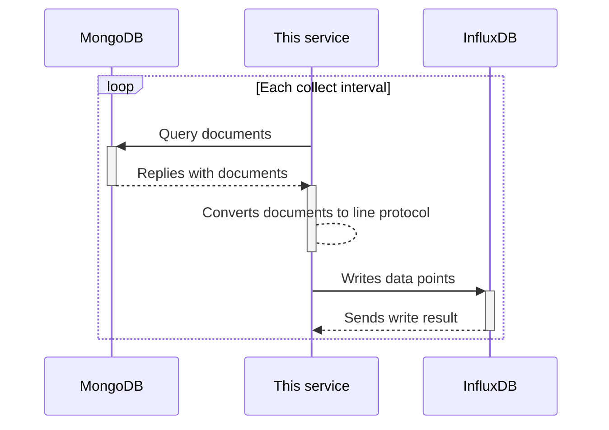

# mongodb-influxdb

[](https://conventionalcommits.org)

## Specifications

This service is responsible for data flow between MongoDB and InfluxDB. It has following roles.

### Recording data from MongoDB to InfluxDB

This service will query the configured database and collection at regular interval (configured by a CLI argument), and send data points to InfluxDB (line protocol), one for each document in the collection. The measurement will be set to the namespace of the collection.

Data points will have following characteristics:

- document primary key (`_id`) as a tag value, with `id` as the tag key;
- each key and value pair in the `val` sub-document, respectively as field key and value;

## Data flow



## Usage

```ShellSession
$ mongodb-influxdb --help
Usage: mongodb-influxdb [OPTIONS] --mongodb-database <MONGODB_DATABASE> --mongodb-collection <MONGODB_COLLECTION> --influxdb-api-token <INFLUXDB_API_TOKEN> --influxdb-org <INFLUXDB_ORG> --influxdb-bucket <INFLUXDB_BUCKET>

Options:
      --interval <INTERVAL>
          Scraping interval [env: INTERVAL=] [default: 1m]
      --mongodb-uri <MONGODB_URI>
          URI of MongoDB server [env: MONGODB_URI=] [default: mongodb://mongodb]
      --mongodb-database <MONGODB_DATABASE>
          MongoDB database [env: MONGODB_DATABASE=]
      --mongodb-collection <MONGODB_COLLECTION>
          MongoDB collection [env: MONGODB_COLLECTION=]
      --influxdb-url <INFLUXDB_URL>
          InfluxDB root URL [env: INFLUXDB_URL=] [default: http://influxdb:8086]
      --influxdb-api-token <INFLUXDB_API_TOKEN>
          InfluxDB API token with write-buckets permission [env: INFLUXDB_API_TOKEN=]
      --influxdb-org <INFLUXDB_ORG>
          InfluxDB organization name or ID [env: INFLUXDB_ORG=]
      --influxdb-bucket <INFLUXDB_BUCKET>
          InfluxDB bucket to write to [env: INFLUXDB_BUCKET=]
  -v, --verbose...
          Increase logging verbosity
  -q, --quiet...
          Decrease logging verbosity
  -h, --help
          Print help
```
