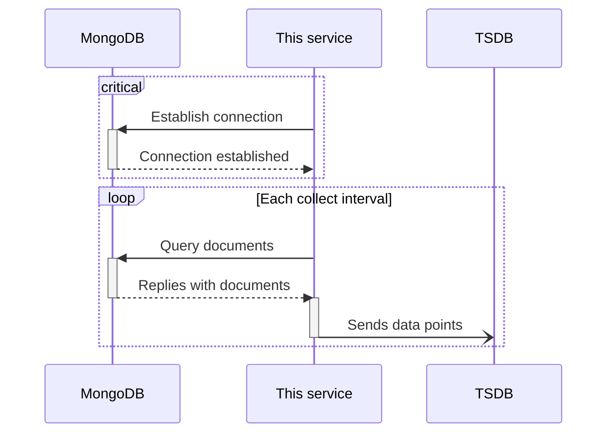

# mongodb-scraper

[](https://conventionalcommits.org)

## Specifications

### MongoDB

This service will query the configured database and collection at regular intervals.

### InfluxDB

After having obtained documents from MongoDB, this service will send data points to InfluxDB (line protocol), one for each document in the collection.

## Data flow



## Usage

```ShellSession
$ mongodb-scraper --help
🚧
```
